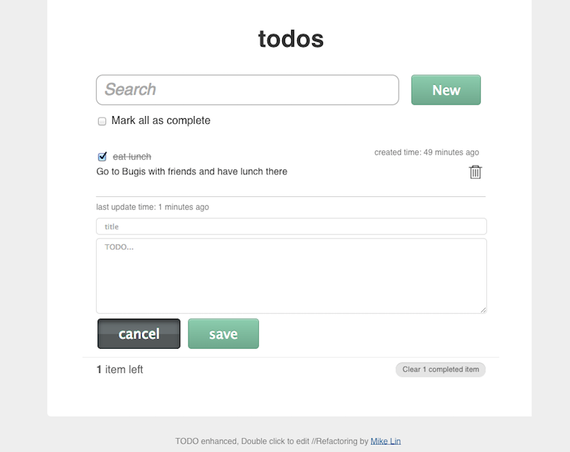

# 

## Overview

[TODO Enhanced](https://github.com/linmxy/todo-enhanced) is an experimental boilerplate for MVP web development. Helping you to stay productive following the best practices outlined in Google's [Web Fundamentals](http://developers.google.com/web/fundamentals).

## Quickstart

[Download](https://github.com/linmxy/todo-enhanced/archive/master.zip) the source code or clone this repository and build on what is included in the `src` directory.

main code directory:

- `src` - contain all original resources including css, html, javascript, img...
- `public` - contains compressed/optimized/concated resources. usually served in product enviroment

Be sure to look over the [installation docs](doc/install.md) to verify your environment is prepared to run the application.
Once you have verified that your system can run, check out the [commands](doc/commands.md) available to get started.
